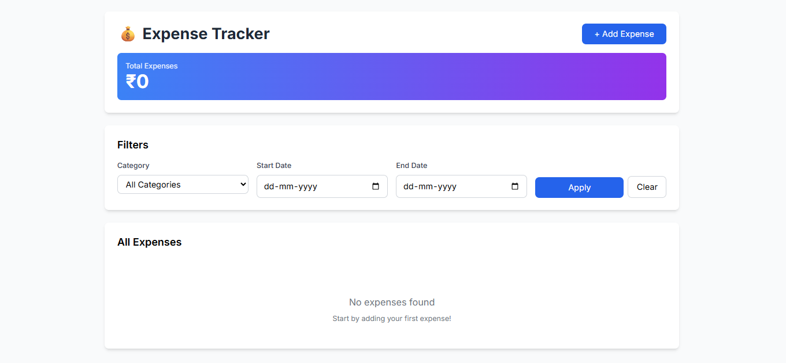
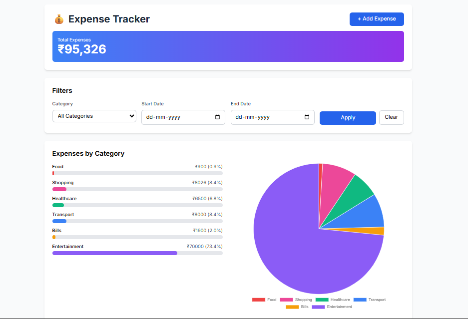
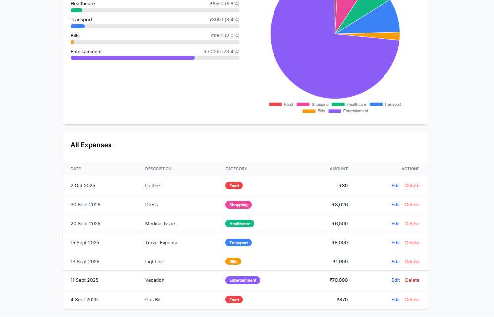

💰 Expense Tracker (Remix + TypeScript + SQLite)

A full-featured expense tracking application built with Remix
, TypeScript, SQLite, and Tailwind CSS.
It supports CRUD operations, filters, category & date breakdowns, and data visualizations with bar and pie charts.

✨ Features

Add / Edit / Delete Expenses with validation

Filter by category and date range

Total expenses summary displayed prominently

Bar chart + Pie chart for category breakdown

Responsive UI built with Tailwind CSS

Reusable components:

PageWrapper (layout wrapper)

FormField (form input abstraction)

ExpenseTable (shared expense table with edit/delete actions)

PieChart (category visualization)

📂 Project Structure
app/
├── components/ # Reusable UI components
│ ├── PageWrapper.tsx
│ ├── FormField.tsx
│ ├── ExpenseTable.tsx
│ └── PieChart.tsx
├── lib/ # Database logic
│ └── db.server.ts
├── routes/ # Remix routes
│ ├── \_index.tsx # Dashboard (list, filters, charts)
│ ├── add.tsx # Add expense
│ ├── edit.$id.tsx   # Edit expense
 │    └── delete.$id.tsx # Delete expense
├── types/expense.ts # Category types
└── root.tsx # App root

🚀 Setup Instructions

1. Clone the repo
   git clone https://github.com/YOUR_USERNAME/expense-tracker-remix.git
   cd expense-tracker-remix

2. Install dependencies
   npm install

3. Run the app in development
   npm run dev

Visit http://localhost:3000
🎉

4. Build and run in production
   npm run build
   npm start

📝 Approach

The goal was to build a clean, maintainable, and user-friendly expense tracker with Remix and TypeScript.
Here’s how I approached it:

Remix for full-stack simplicity:
Used Remix routes for pages (/, /add, /edit/:id, /delete/:id) with loaders and actions to connect UI with the database.

SQLite for persistence:
Chose SQLite for its simplicity — no external server needed, just a file-based DB. All queries were wrapped in db.server.ts.

TypeScript for safety:
Strong typing ensured fewer runtime bugs. Shared types (like CATEGORIES) were centralized in types/expense.ts.

Reusable UI components:
Extracted repeated code into PageWrapper, FormField, ExpenseTable, and PieChart to keep route files clean and encourage scalability.

Validation & UX:
Added server-side validation in actions, and clear error messages in forms. Delete action confirms before execution.

Visualization:
Used both bar charts and a pie chart to give different perspectives of category breakdowns. Colors are consistent across charts and category tags.

Responsive design:
Used Tailwind utilities like flex-col md:flex-row to ensure charts and tables render well on mobile and desktop.

📦 Tech Stack

Remix
(Full-stack React framework)

TypeScript

SQLite
with sqlite3

Tailwind CSS
for styling

Chart.js
via react-chartjs-2 for pie chart

🗄️ Database

The app uses SQLite. A local file (expense.db) is automatically created and migrated.
To reset:

rm expenses.db

📸 Screenshots

### Dashboard

### Filters & Expense Table

### Charts (Bar + Pie)

